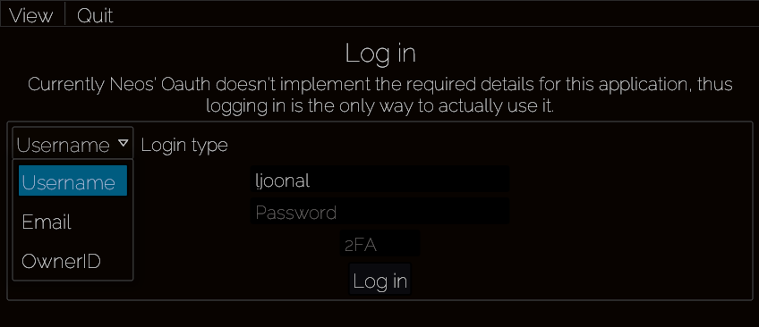
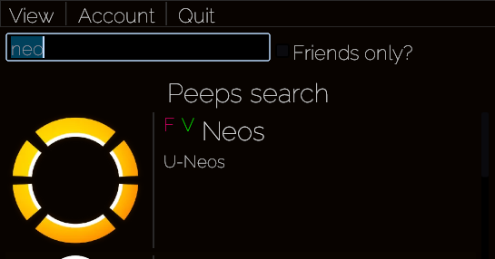

# Neos Peeps

NeosPeeps is tool that allows for listing your [NeosVR](https://steamcommunity.com/app/740250) friends quickly, without having to actually open the whole game.

All the following functionality, in under 5MB:

- Listing your friends

- Listing all the sessions, or only the ones that your friends are in

- Logging in, even with email or with 2fa enabled

- Searching the lists

- Showing details of a particular peep

- Refreshing the data in the background every so often
- Resizable grid

- CJK font support for all of you JP peeps

## License

Note that the license is [AGPL](https://tldrlegal.com/license/gnu-affero-general-public-license-v3-(agpl-3.0)).
This is mainly meant to prevent anyone from commercializing this application.

In a short and non-legally binding way:
AGPL means that if you make changes and distribute the software, you will also have to provide the source code if asked for it.
In addition you'll need to provide the source code for any remote clients of the application if they ask for it.
You could technically sell it, but you'd still need to give out the source code if asked for it as well as build instructions, at which point, why would anyone pay you for it if they can just build it for free?

## Building

Make sure you have the [Rust programming language](https://www.rust-lang.org/) installed.

Then in the project directory just run the `cargo run` command.

For building the releases on a standard linux distro, see [build-release.sh](./build-release.sh).
For publishing to gitea, see [gitea-publish.sh](./gitea-publish.sh)
